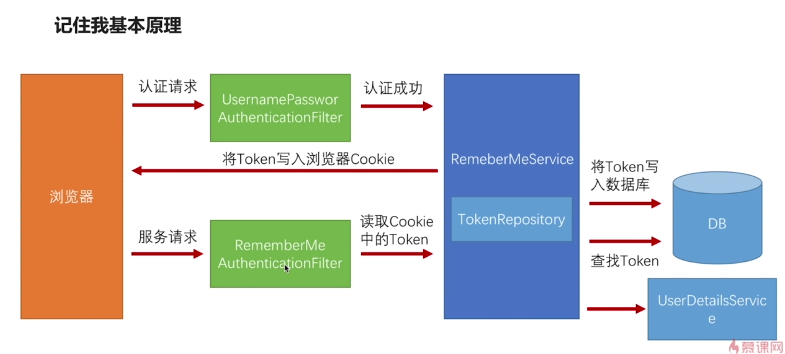

# 4-9 添加记住我功能

## 实现"记住我"功能

* 记住我功能基本原理
* 记住我功能具体实现
* 记住我功能 Spring Security 源码解析

### 记住我基本原理

//记住我配置，如果想在'记住我'登录时记录日志，可以注册一个InteractiveAuthenticationSuccessEvent事件的监听器
.rememberMe()
    .tokenRepository(persistentTokenRepository())
    .tokenValiditySeconds(securityProperties.getBrowser().getRememberMeSeconds())
    .userDetailsService(userDetailsService)

