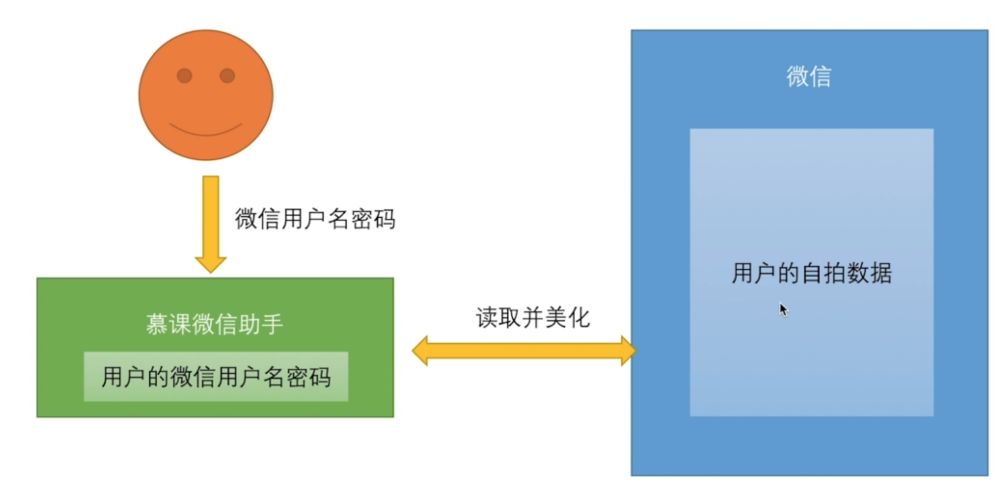
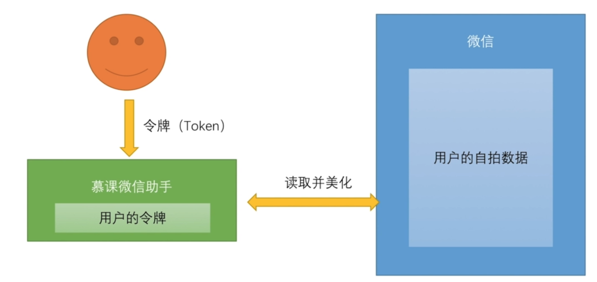
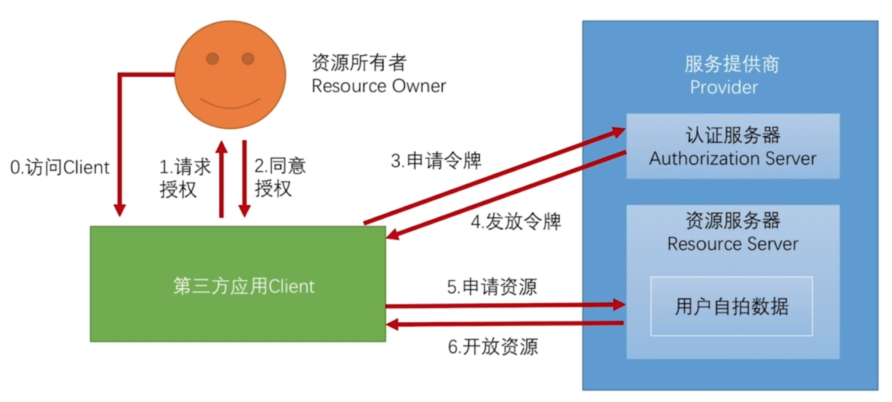
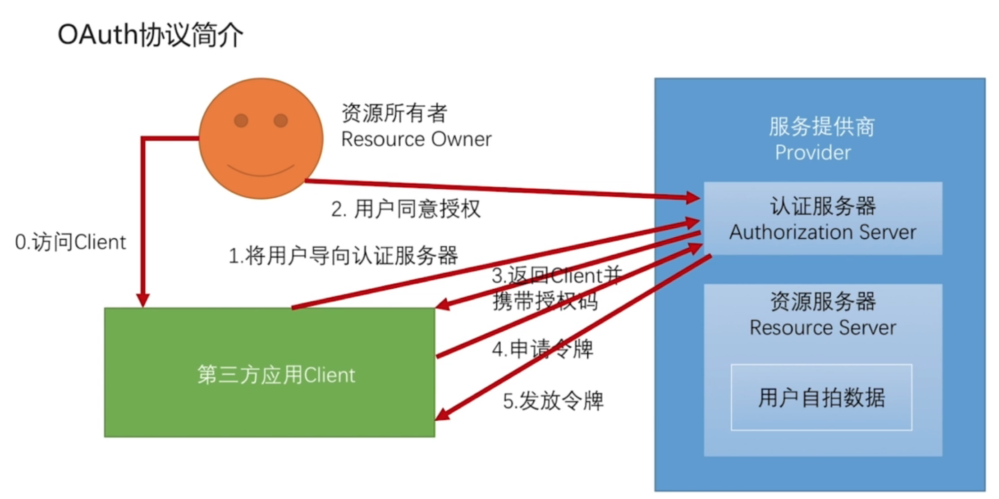

# 5-1 OAuth协议简介

## 使用 Spring Social 开发第三方登陆

### OAuth 协议简介

* OAuth 协议要解决的问题
* OAuth 协议中的各种角色
* OAuth 协议运行流程

#### OAuth 用户名密码模式

* 问题
  
  * 应用可以访问用户在微信上的所有数据
  * 用户只有修改密码，才能收回授权
  * 密码泄漏的可能性大大提高

#### OAuth 令牌模式

#### OAuth 基本流程

* 优势
  
  * 认证必须通过认证服务器完成，能够保证用户亲自授权
  * 用户同意授权后，第三方应用需要通过授权码再换取Token,要求第三方应用必须要有自己的服务器
  * 第三方应用没有服务器，可以采用简化模式，安全性相对较低

#### OAuth 协议中的授权模式

* 授权码模式（authorization code）
  
  
  
  * 优势
    
    * 认证必须通过认证服务器完成，能够保证用户亲自授权
    * 用户同意授权后，第三方应用需要通过授权码再换取Token,要求第三方应用必须要有自己的服务器
    * 第三方应用没有服务器，可以采用简化模式，安全性相对较低
  
* 密码模式（resource owner password credentials）
* 客户端模式（client credentials）
* 简化模式（implicit）
  
  > 第三方应用没有服务器，令牌存储在浏览器
  

